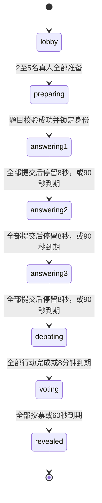

# 人味圆桌局：游戏核心设计

> 日期：2026-09-10
> 状态：核心及主要后端能力已实现；证据等级和外部/目标环境限制见[验证状态矩阵](../contracts/validation-status.md)。
> 依据：[P0 规则书 1.0](../product/game-rules.md)。本文不修改冻结规则；未明确的行为标注为设计建议。

## 1. 设计范围与关键结论

采用一个长期运行的 Node 服务承载 Next.js 页面、Socket.IO 和房间运行时。每个房间独立维护权威状态，按顺序处理动作。游戏核心不依赖 React、Socket.IO、数据库或模型 SDK。

- 真人 2/3/4/5 人对应总座位 3/5/6/8 个；观战者不占座。
- AI 与影子不是同一阵营：AI 仅在普通人和影子都未获胜时获胜。
- 投票只有一个阶段，在三轮回答与辩论之后；全体座位各一票。
- 投票实时公开关系，出局与票的有效性直到结算才公开，否则会泄露投票者身份。
- 每局保留全部轮次、辩论和投票记录；网络重连恢复原座位。
- 对局必须先获得有效的知乎题目。全部候选失败时不能用离线题偷偷开局。

## 2. 状态机



三个答题状态在数据中统一为 `answering`，使用 `round: 1 | 2 | 3` 区分。`revealed` 是终态；另开一局使用新的 matchId，避免旧动作进入下一局。

| 状态 | 允许的动作 | 进入时的工作 | 结束条件 |
|---|---|---|---|
| lobby | 入座、准备、取消准备、观战 | 建立真人候场列表 | 至少2人且全部准备 |
| preparing | 重连、观战 | 锁定本局真人名单，按片单请求题目 | 成功取得并校验题目 |
| answering | 每座位提交一次答案 | 设置90秒截止时间，启动AI任务（每座位先等自己的节拍） | 全员完成后停留8秒，或超时补全 |
| debating | 当前指认者/应答者发言 | 设置行动顺序、全局及子阶段截止时间 | 全部完成或总时限到期 |
| voting | 每座位提交一票 | 设置60秒截止时间，启动AI投票 | 全员完成或超时记未投票 |
| revealed | 查看记录、观战 | 一次性结算并公开身份 | 本局结束 |

人数与准备条件满足后立即锁定名单；第三人加入和第二人准备若同时发生，以服务端处理顺序为准。界面明确显示当前人数和“全员准备后立即开始”。

### 辩论子状态

`accusation(20秒) → response(45秒) → followup(20秒) → 下一座位`

- 指认者选择非自己的目标并提交指认文本；被指认者回复一次；指认者可追加一次追问。
- 提交后立即推进；追问可主动跳过。按现有规则，追问后没有额外的第二次应答。
- 非当前行动双方不能向辩论流发言；允许观察。
- 实际子阶段截止时间取“该阶段时限”和“全桌8分钟截止时间”的较早值。
- 全局超时优先：关闭当前辩论，直接进入投票，迟到消息无效。
- 指认超时仍需有效目标，建议由服务端选取下一个非自己座位并填默认指认；应答超时填默认回应；追问超时直接结束。

**规则边界：**8个座位的最大用时为680秒，超过480秒总上限。因此不能同时保证每座位完整行动和硬性8分钟上限。按已确认的规则优先执行总上限；后面的座位可能没有指认机会。建议每局随机分配匿名座位，再按座位号行动，避免同一真人总在末位。

## 3. 权威数据模型

以下为设计类型，不是已经实现的接口。

| 对象 | 主要字段 | 用途 |
|---|---|---|
| Room | roomId、lobbyMembers、currentMatchId | 候场与对局入口 |
| ParticipantSession | participantId、凭据摘要、roomId、seatId?、viewerMode | 重连认证；不使用socket.id作为玩家身份 |
| MatchState | matchId、revision、phaseToken、phase、topic、seats、rounds、debate、votes、result | 完整服务端状态 |
| Seat | seatId、displayNumber、controller、role、participantId? | controller为真人/模型；role为普通人/影子/AI |
| RoundState | round、deadlineAt、answersBySeat | 独立保存三轮答案 |
| Answer | seatId、text、acceptedAt、seq | 一座位一轮一条；第二轮含正/反方 |
| DebateState | order、turnIndex、step、accuserSeatId、targetSeatId、stepDeadlineAt、globalDeadlineAt | 当前辩论行动 |
| DebateEntry | turn、step、speakerSeatId、targetSeatId?、text、seq | 可回看辩论记录 |
| VoteRecord | voterSeatId、targetSeatId或null、submittedAt | null仅代表系统记录的未投票 |
| Result | eliminatedSeatIds、winner、validVotes、roles | 结算一次并保存结果 |
| GameLogEntry | seq、phase、type、publicPayload、at | 有序的游戏日志 |

时间统一使用服务端毫秒时间戳。`revision` 每次接受状态变化后递增；`phaseToken` 每次阶段/辩论子阶段变化后更新，防止迟到动作误入新阶段。

外部供应商、默认答案来源、错误原因、模型调用用量等放入内部诊断记录，不能混进公开游戏日志。“完整日志”指完整游戏行为记录，不包含密钥、模型提示词、认证凭据或隐藏推理。

### 匿名和可见性

| 数据 | 本人 | 其他玩家 | 观战者 | 服务端AI上下文 |
|---|---|---|---|---|
| 自己身份 | 可见 | 不可见 | 不可见 | 全部身份可见 |
| 匿名座位、已提交答案、辩论、投票关系 | 可见 | 可见 | 可见 | 可见 |
| controller、真人账号关联、AI模型信息 | 不下发 | 不下发 | 不下发 | 按需提供 |
| 默认回答/调用失败来源 | 不下发 | 不下发 | 不下发 | 无需提供 |
| 结算后的身份、有效票、出局和胜方 | 可见 | 可见 | 可见 | 可见 |

开局后不公开每座位网络在线状态，避免“只有真人会断线”成为身份线索；客户端可以看到自己的连接状态。匿名座位号整局固定，回答、指认和投票都使用同一编号。

普通人与影子的私有身份单独投影到 `self`；观战者没有 `self.role`。AI的全身份上下文仅在服务端构造。

## 4. 动作与结算规则

### 答题

每座位每轮只接受一次。空文本、超长文本、错误轮次均拒绝，不静默截断。第二轮采用单独的立场选择和理由输入，公开显示为“正方：理由”或“反方：理由”，总计不超过50字。

建议字数按可见字素计数，标点计入、首尾空白去除，客户端与服务端共用同一计数规则。输入确认后马上进入全房间聊天流。

截止时补全所有缺失答案，再推进；提前全员提交则立即推进。AI失败先等待统一的默认补全时机，避免立即回退暴露失败来源。

### 投票与胜负

客户端不能提交空目标，也没有弃权动作；只有截止处理能写入未投票。投票期间不标记有效票或出局，不取消任何已被指向座位的行动资格。

```text
有效票 = 所有普通人投出的、目标非空的票
出局集合 = 有效票的目标集合（去重）
若所有AI座位都在出局集合：普通人胜
否则：影子胜（规则v1.1；影子是否出局不影响，AI无独立胜方）
```

即使某普通人被其他普通人指向，其票仍参与本次结算。所有出局同时产生，无先后淘汰。规则v1.1起影子的阵营胜负不再绑定自身存活；`winner`字段类型保留`ai`仅为兼容旧存档读取。

数量相等意味着普通人胜利时，每张普通票必定命中不同AI，不可能同时投出影子。规则书的“即使同时有影子出局”在当前人数规则下不可达。

## 5. 客户端事件协议

入场事件使用`requestId`，对局写动作使用`commandId + matchId + phaseToken`。服务端从认证会话识别发起者，不接受客户端声明座位或角色。完整事件签名不在本文重复维护，以`src/server/socket-contracts.ts`和[Socket协议](socket-protocol.md)为事实来源。

服务端发送 `room:state`：经过接收者权限投影的完整快照，含 `revision`、`serverNow`、截止时间、可执行动作、公开记录和本人私有身份。P0最多8座位，优先使用完整快照减少增量合并复杂度。

动作回执为成功（commandId、revision）或失败（commandId、revision、错误码）。面向用户的文案由客户端映射，协议不传文案。规则和系统错误需要提示；外部AI/题目供应商错误不直接展示。

同一commandId重试返回原回执；不同commandId重复提交由“一轮一答/一人一票”约束拒绝。没有客户端推进阶段或提交胜负结果的事件。

## 6. 房间运行时与外部任务

每房间一个串行命令队列，处理真人命令、AI完成事件和定时器事件。异步模型/题目请求在队列外执行，完成后重新入队，不能阻塞整间房。

处理顺序：认证与阶段校验 → 规则转换 → 保存状态及日志 → 发布视图 → 安排后续任务。状态和日志写入失败时不确认成功、不发布未保存状态。

- 定时器只负责唤醒；执行动作前再次比较服务端当前时间与deadlineAt。到点后到达的输入按超时处理。
- 所有AI任务绑定matchId、phaseToken、seatId；阶段变化后取消或忽略迟到结果。
- AI拥有与普通座位相同的动作次数和目标限制；其答案、指认、应答、追问、投票都必须通过核心校验。
- AI知道全部身份；结构化Prompt、基础泄露过滤和主备网关已实现，GLM七动作有单次真实验证。完整审核、长期稳定和DeepSeek真实验证仍未完成。
- 默认回答与真人超时共用池。建议补充通用辩论默认指认和回应；AI投票失败也按截止未投票处理，不生成额外有效票。
- 部署先采用单实例；多进程共同写同一房间需要额外协调，不在P0范围内。

### 重连与保存

重连凭据与socket.id解耦，采用不可猜测的服务端凭据；新连接恢复同一participantId。建议同一身份只允许最新连接写入，旧连接失去操作权限，避免多标签页重复控制。

整局不因断线释放座位、不由新玩家替补。SQLite持久化完整私有快照、公开日志和必要会话关联；公开RoomView不能用来恢复权威状态。运行中的定时器句柄和网络连接不入库。

重启后主动恢复所有非终局房间，依据绝对截止时间补做超时动作并重新安排剩余时间。断线不回收本局座位；终局默认保留24小时，会话默认48小时，均可通过`ServerContextConfig`覆盖。

## 7. 题目与默认答案

规则书附录B已正式化为TopicPack v1。选择题目时校验知乎问题标识、标题、原文链接、第三轮高赞回答材料、三轮默认答案池和来源元数据。

知乎热榜接口提供问题标题、URL和摘要；站内搜索提供回答正文、赞同数和精选评论。实现按回答URL中的问题ID精确过滤，在最多10条搜索结果中按赞同数、排序分数选取本局高赞回答。接口不保证覆盖全站全部回答，共识摘要和默认答案仍由题目包人工预制。

失败后按候选顺序换题；每个请求设置超时。同一轮候选全部失败，建议保留在preparing，用中性“正在准备题目”状态并退避重试，允许用户离开；不无限高频调用，不以未验证题目开局。

题目默认答案池可以按座位轮换、用完循环；两条以上的池无法保证最多8座位不重复，因此不承诺完全避免重复。内容在题目锁定后固定，不因接口重试把其他题的默认答案带入本局。

辩论超时默认内容目前由核心提供：

```json
{
  "debateDefaults": {
    "accusation": ["@{seat}，我认为你是AI。"],
    "response": ["仅凭刚才的回答，还不足以下这个结论。"]
  }
}
```

追问可跳过，无需默认内容。辩论文本字数上限尚未规定，建议实现前明确；技术请求体大小限制与游戏字数规则分开处理。

## 8. 当前项目结构

```text
docs/product/game-rules.md
docs/architecture/game-core-design.md
server.ts                         # Node/Next/Socket启动入口
src/
  app/                            # Next页面与样式
  components/                     # 入场和默认房间组件
  client/                         # Socket会话控制器
  ui/                             # Theme、RoomSlots和展示配置
  game/
    model.ts                      # 私有权威模型
    rules.ts                      # 人数、时限、长度配置
    transition.ts                 # 纯状态转换
    settlement.ts                 # 出局和胜负
    projection.ts                 # 玩家/观战视图裁剪
  contracts/                      # 公开类型、事件、输入校验
  application/
    room-runtime.ts               # 队列、时限、事务和任务编排
    ports.ts                      # 题目、AI、存储、时钟、随机源
  server/                         # 会话、Socket、安全、健康与依赖组装
  topics/                         # TopicPack、缓存、核验接口和开发题目
  ai/                             # Prompt、解析、主备网关和模型客户端
  observability/                  # 脱敏日志与指标
  repository/                     # 内存和SQLite实现
tests/                            # 核心规则、协议和端到端验收
scripts/                          # 仓库审计、备份和生产冒烟
deploy/                           # Caddy配置
Dockerfile / compose.yaml         # 单实例容器部署
```

核心仅依赖领域类型。application调用核心并通过ports访问外部能力；server负责接线；客户端只导入公开contracts和UI。真人/模型控制信息与公开角色视图不共用一个直接序列化的Seat类型。

## 9. 实现状态与验收

| 状态 | 工作 | 验证 |
|---|---|---|
| 已实现 | 核心模型、结算、投影、运行时、超时 | 自动测试 |
| 已实现 | 会话、Socket、SQLite恢复、安全和备份 | 自动测试与生产冒烟 |
| 已实现 | 开发版页面、主题和组件扩展接口 | 类型检查与Next构建 |
| 外部单次验证 | GLM七动作、知乎热榜/搜索及9个题目 | 不代表长期稳定或SLA |
| 仅代码支持 | DeepSeek接入与failover | 尚无真实DeepSeek Key验证 |
| 待内容运营 | 扩充并人工审核TopicPack | 默认答案和共识与问题一致 |
| 待目标环境验收 | 公网代理、多人长局、移动端、磁盘/备份 | 部署环境测试 |

开发测试可使用显式测试题目和模拟AI；公开运行仍必须满足知乎题目校验的开局条件。

关键验收用例：

- 四档真人数量的身份计数准确，匿名座位不携带角色线索。
- 错阶段、重复答案、非法目标、自投均拒绝。
- 三轮与辩论结束前不能投票，已投票不能撤销。
- 普通人投中各个不同AI则普通人胜；未全歼时影子胜（规则v1.1，影子存活与否不影响）。
- 普通人未全歼AI时影子胜，包括影子全部被投出的情况；影子/AI干扰票不产生出局。
- 被普通票指向的普通人，其已投出的票仍参与同时结算。
- 缺失投票记录为未投票；普通人未全歼AI时影子胜。
- 90秒、辩论各子时限、8分钟和60秒截止处理不会重复推进。
- 全员发言完毕后的8秒停留不会重复触发，停留期间界面上仍是本轮，下一轮拿到完整时限。
- AI 座位的发言节拍留在这轮时限内，短阶段（指认20秒）不会因为等待而挤掉生成预算；节拍窗口随题面长度平移，长题面更晚开口。
- 超时指认有有效目标；全局辩论截止后无人可继续发言。
- 玩家与观战视图不泄露他人身份、网络状态、默认来源和有效票标记。
- 断线、重连、服务重启、AI迟到都不能制造重复行动或改变已确认投票。
- 所有候选题失效时不进入回答阶段；换题后默认内容仍匹配题目。

## 10. 已采用的补充设计

已按规则v1.1确定的边界：影子胜利不再要求全部影子存活（AI无独立胜方）；8分钟辩论上限优先；出局统一在投票结束后计算。

实现已采用随机匿名座位、指认超时选择下一座位、通用辩论回应、4096字节辩论技术上限以及题目失败退避。这些属于技术行为；若要改变产品体验，应先更新规则与测试。
